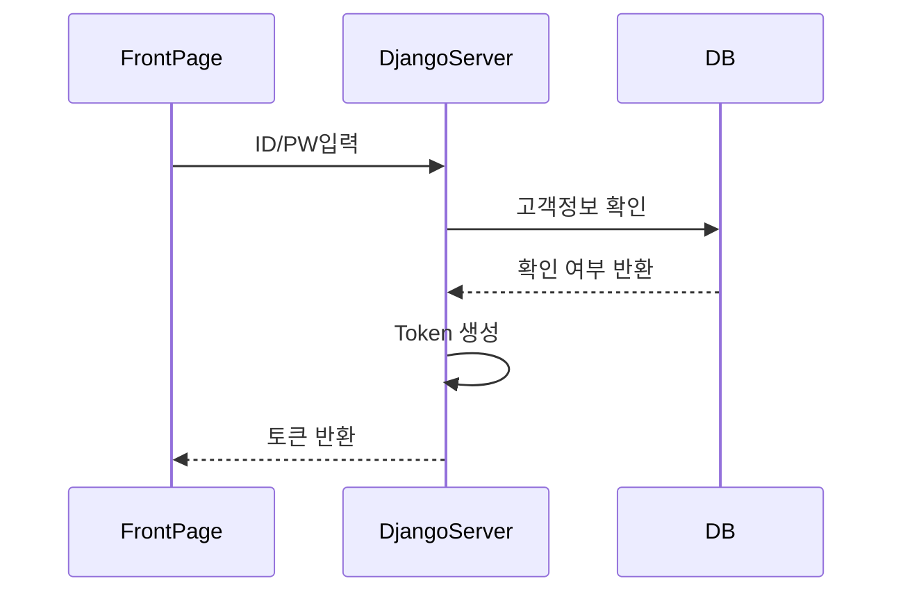
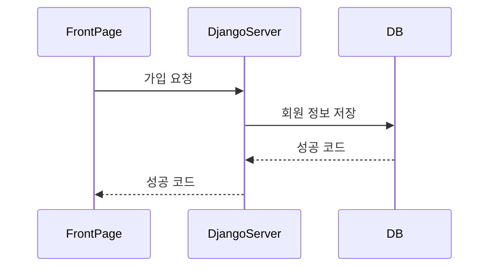
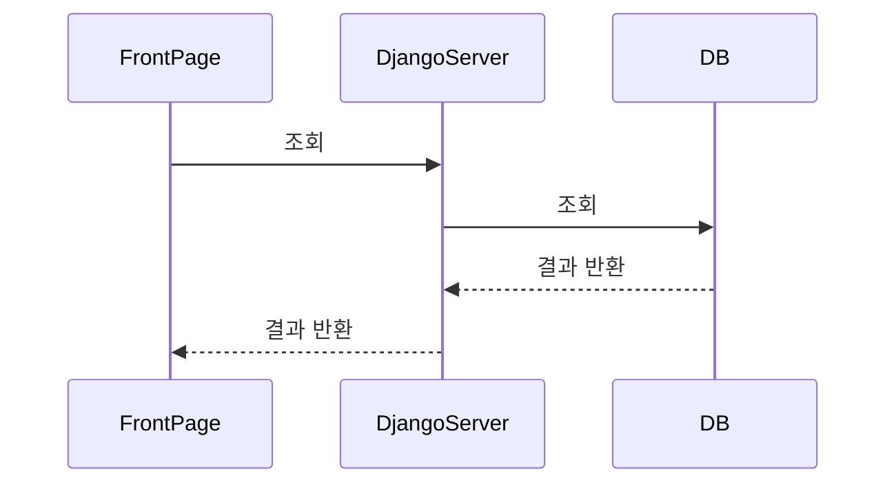
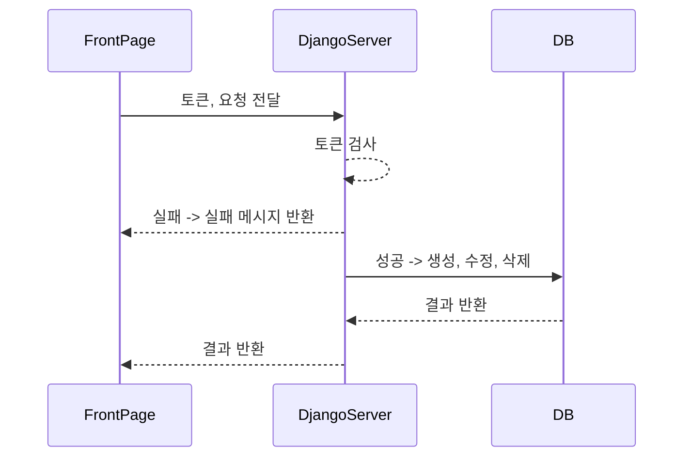
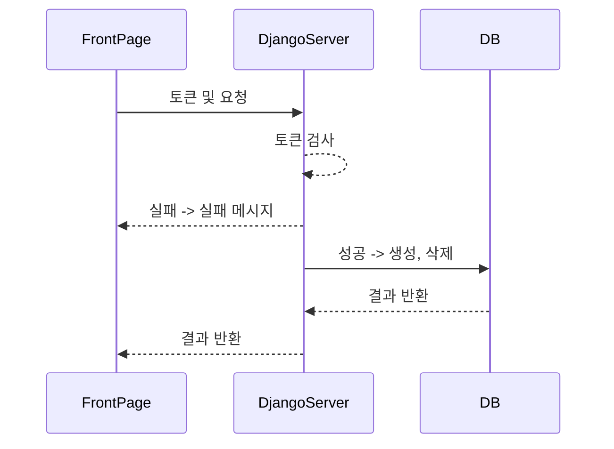
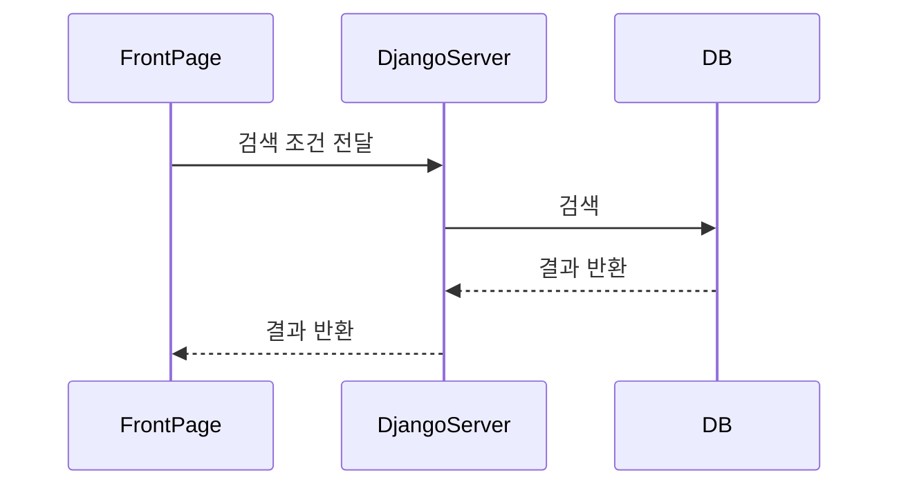
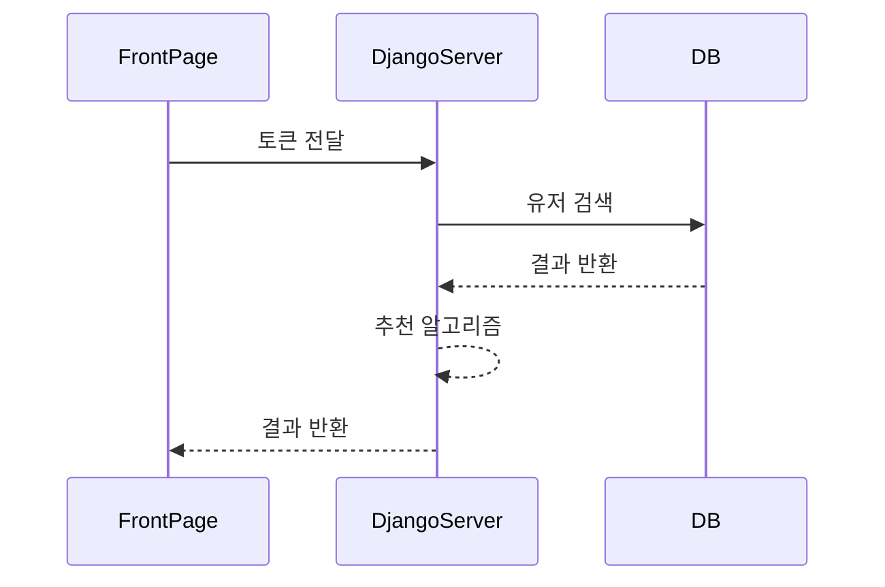

# 영화 추천

## 1. 로그인

로그인은 간단하게 ID, PW 입력을 통해 DB를 확인하여 로그인을 진행

```mermaid
sequenceDiagram

FrontPage->>DjangoServer:ID/PW입력
DjangoServer->>DB : 고객정보 확인
DB -->> DjangoServer: 확인 여부 반환
DjangoServer ->>DjangoServer : Token 생성
DjangoServer -->> FrontPage: 토큰 반환

```

## 2. 회원 가입

```mermaid
sequenceDiagram

FrontPage ->> DjangoServer : 가입 요청
DjangoServer ->> DB : 회원 정보 저장
DB -->> DjangoServer : 성공 코드
DjangoServer -->> FrontPage : 성공 코드

```

## 3. 게시글

### 조회

```mermaid
sequenceDiagram
FrontPage ->> DjangoServer : 조회
DjangoServer ->> DB : 조회
DB -->> DjangoServer : 결과 반환
DjangoServer -->> FrontPage : 결과 반환
```

### 생성, 수정, 삭제

```mermaid
sequenceDiagram
FrontPage ->> DjangoServer : 토큰, 요청 전달
DjangoServer -->> DjangoServer: 토큰 검사 
DjangoServer -->> FrontPage : 실패 -> 실패 메시지 반환
DjangoServer ->> DB : 성공 -> 생성, 수정, 삭제 
DB -->> DjangoServer : 결과 반환
DjangoServer -->> FrontPage : 결과 반환
```

## 4. 댓글, 리뷰

### 조회

```mermaid
sequenceDiagram
FrontPage ->> DjangoServer : 조회
DjangoServer ->> DB : 조회
DB -->> DjangoServer : 결과 반환
DjangoServer -->> FrontPage : 결과 반환
```

### 생성, 삭제

```mermaid
sequenceDiagram
FrontPage ->> DjangoServer : 토큰 및 요청
DjangoServer -->> DjangoServer: 토큰 검사 
DjangoServer -->> FrontPage : 실패 -> 실패 메시지
DjangoServer ->> DB : 성공 -> 생성, 삭제
DB -->> DjangoServer : 결과 반환
DjangoServer -->> FrontPage : 결과 반환
```

## 6. 영화 검색

```mermaid
sequenceDiagram
FrontPage ->> DjangoServer : 검색 조건 전달
DjangoServer ->> DB : 검색
DB -->> DjangoServer : 결과 반환
DjangoServer -->> FrontPage : 결과 반환
```

## 7. 추천

```mermaid
sequenceDiagram
FrontPage ->> DjangoServer : 토큰 전달
DjangoServer ->> DB : 유저 검색
DB -->> DjangoServer : 결과 반환
DjangoServer -->>DjangoServer : 추천 알고리즘
DjangoServer -->> FrontPage : 결과 반환
```

